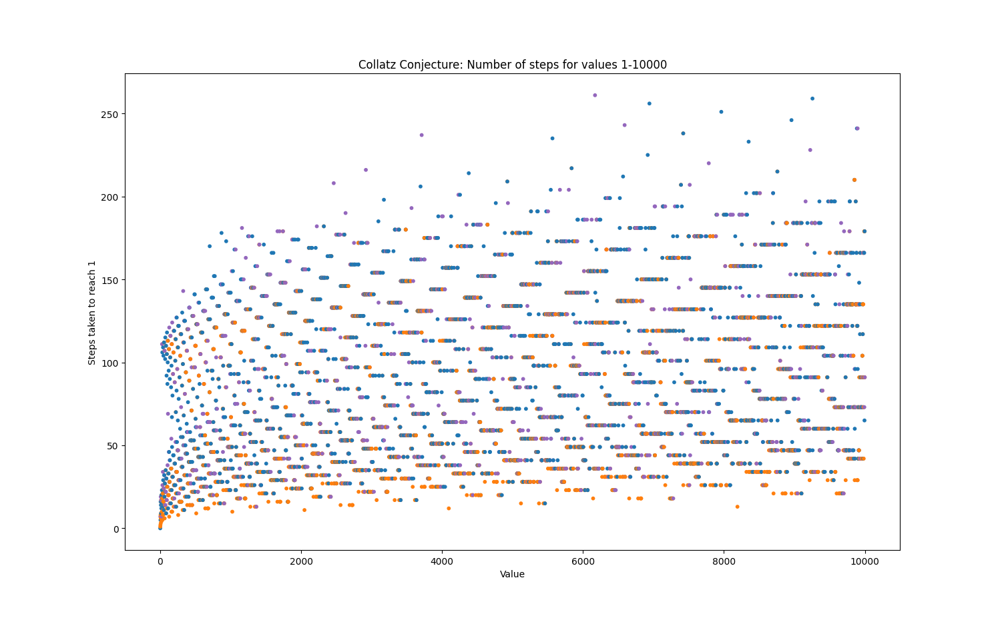

# Collatz Conjecture visualization
This is a very simple visualisation of the [Collatz conjecture](https://en.wikipedia.org/wiki/Collatz_conjecture). I made it as matplotlib practice, since I'm not very experienced with it. 

## Visualisation

- Orange dots are values where the starting number is even
- Purple dots are values where the starting number isn't even and is divisible by 3
- Blue dots are all other starting numbers

## How to run
To run this, you'll need Python and matplotlib (installed with `pip install matplotlib`). 
The Collatz conjecture function does not require matplotlib.

You can change the collatz() return statement to get the largest number in the sequence instead, like this:

```diff
if num == 1:
-       return steps_taken
+       return highest_value
```
